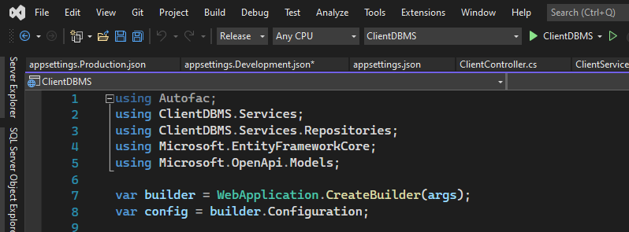

# **How to Read Azure App Service Configuration in .NET Applications**

## Overview

This documentation focuses on how to configure a .net application to read settings from an Azure app service configuration using either the default configuration or the configuration builder. We'll take it a step further by first discussing azure app configuration and how it differs from app settings, sectors in app configurations, and how to input settings.

## Prerequisite

- .NET 6 web API
- Active Azure subscription

## Azure App Service Configuration vs Appsettings.json

### Azure App Service

Developers are advised to remove any sensitive information from the web before deploying applications. A common solution is to use Azure app service configuration. It will contain any sensitive data that the application will use.
There are two sections in the app configuration window:

- **Application settings**: store values in name-value pairs like email configuration, token secret, and key vault reference.
- **Connection strings**: Database connection strings are stored. This section accepts connection strings for **MySql**, **SQLServer**, **SQLAzure**, **PostgreSQL**, and **any custom connection string**.

Both of these sections have a deployment settings check box. This indicates that a setting is associated with the slot.

An example of an Azure app service configuration window is shown below.


### Appsettings.json

Appsettings.json is a json file that stores configuration values in the form of name-value pairs but in a json format.
Depending on our hosting environment, we have multiple appsettings.json files. When we create a .NET application, some files like appsettings.json and appsettings.development.json are automatically generated.

#### appsettings.json

```json
{
  "Logging": {
    "LogLevel": {
      "Default": "Information",
      "Microsoft.AspNetCore": "Warning"
    }
  },
  "AllowedHosts": "*",
  "ConnectionStrings:DefaultConnection": "Data Source=(localdb)\\ProjectModels;
  Initial Catalog=master;Integrated Security=True;
  Connect Timeout=30;Encrypt=False;TrustServerCertificate=False;
  ApplicationIntent=ReadWrite;MultiSubnetFailover=False",
  "Message": {
    "Chat": "Hello son"
  }
}
```

#### appsettings.Development.json

```json
{
  "Logging": {
    "LogLevel": {
      "Default": "Information",
      "Microsoft.AspNetCore": "Warning"
    }
  }
}
```

#### appsettings.Production.Json

```json
{
  "ConnectionStrings": {
    "DefaultConnection": "Server=(localdb)\\MSSQLLocalDB;
    Database=_CHANGE_ME;
    Trusted_Connection=True;
    MultipleActiveResultSets=true"
  }
}
```


## Input Values in Azure App Service Configuration

So now we are a little bit comfortable with the environment, we can proceed to input our settings in application settings and the database connection string into the connection strings.

???+ tip 

    You can replace ':' with ' __' . Both are supported in azure app configuration


???+ important

    Check that the names of your configuration values in appsettings.json match the names in your Azure app configuration.

This simply means that when you deploy to an Azure web service, the azure app configuration will override your app settings.

## Using Default Configuration

The default configuration comes with .NET applications. It contains configuration providers that read configuration data from different sources like setting files such as appsettings. json, environment variables, azure key vault, azure app configuration etc.

???+ note
    The default configurations reads from appsettings.json then appsettings.{environment}.json.So if your applications makes use of the default configuration, it has been configured to read from the azure app service configuration when deployed.



## Using Configuration Builder

The configuration builder provides a more flexible way of reading configuration variables. In the application, our configuration is built with appsettings.{environment}.json.Then reloadOnChange is set to true.

???+ tip
    The environment can either be development or production.


???+ important
    reloadOnChange reloads the appsettings after the application starts. So if azure app setting overrides the appsetting and reloadOnChange is set to false. Your application won't see the new changes.

## Summary

Using the default configuration or the configuration builder, your .NET 6 application can read configuration values from the Azure app service configuration. Configuration builder offers more flexibility than the default configuration, and to read from the app service configuration, reloadOnChange must be set to true, whereas the default configuration already has reloadOnChange set to true.